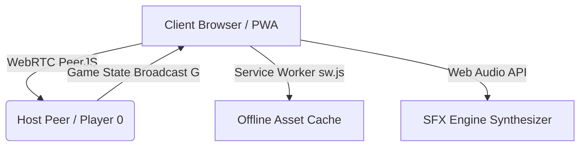

# 🎩 1poly — 8-Player Family Monopoly Mega Edition

Welcome to **1poly**, an ultra-modern, high-performance, 8-player WebRTC real-time multiplayer Monopoly web application designed for family game nights, kids, and mobile devices!

---

## 🌟 Key Features Overview

- **👥 8-Player WebRTC Real-Time Multiplayer:** Instant peer-to-peer room hosting and joining using PeerJS.
- **⚡ 1-Tap Quick-Join Rooms & QR Code Sharing:** 1-click room presets (`ROOM 1`, `FAMILY`, `PARTY 77`) and camera-scannable QR codes for iPads and phones.
- **🤖 Intelligent AI Automaton Family Bots:** Add AI bot opponents with distinct playstyles (Cautious, Tycoon, Aggressive).
- **⚙️ Match Rules & Perks Configurator:** Customize passing GO salary ($200/$300/$500), Free Parking Jackpot, property auctions, Quick-Play timers, and metro warps.
- **🎩 Official Monopoly Mechanics Enforced:** Even building rules, unimproved set rent doubling, 3-doubles jail penalties, 50% mortgaging with 10% interest fees, and unowned property auctions.
- **🎵 Synthesized Web Audio Engine:** Acoustic sound effects (`dice_tumble`, `buy_property`, `pass_go`, `victory`) created dynamically with Web Audio API.
- **📱 PWA Offline Support:** Service worker (`sw.js`) and web manifest (`manifest.json`) for standalone home-screen installation on iOS, Android, and Desktop.

---

## 🎮 Interactive Animated Showcase Webpage

Visit the interactive animated README webpage to preview character tokens, test Web Audio synthesis, and explore game modes:

👉 **[Launch Animated Showcase Webpage (`readme.html`)](https://qamotech.github.io/1poly/readme.html)**

---

## 🕹️ Quick Start Guide

### Playing Online
1. Open **[qamotech.github.io/1poly/](https://qamotech.github.io/1poly/)** on any browser or mobile device.
2. Tap **✨ ENTER GAME LOBBY ✨**.
3. Host a room or join a room using a 1-tap room preset (`ROOM 1`, `FAMILY`) or scan the QR Code on your phone!
4. Tap **🚀 START MATCH & REVEAL BOARD** once player slots are filled!

### Local Single-Device Party Mode
1. Open the game lobby and choose player count (2 to 8 players).
2. Customize player names (`P1`, `P2`, `P3`, etc.) and pick custom emoji tokens (`🎩`, `🚀`, `🦄`, `👑`).
3. Tap **Start Match** to pass the device around during turn changes!

---

## 🛠️ Architecture & Tech Stack

- **Frontend:** HTML5, Vanilla JavaScript (ES6+), Modern CSS3 (Glassmorphic Design, Keyframe Animations)
- **Networking:** PeerJS (WebRTC Peer-to-Peer Data Channels)
- **Audio:** Web Audio API (`AudioContext`, `OscillatorNode`, `StereoPannerNode`)
- **Offline PWA:** Service Worker API (`sw.js`), Web App Manifest (`manifest.json`)

---

## 📜 License

Distributed under the MIT License. See `LICENSE` for more information.

---

Made with ❤️ for family game nights worldwide!

